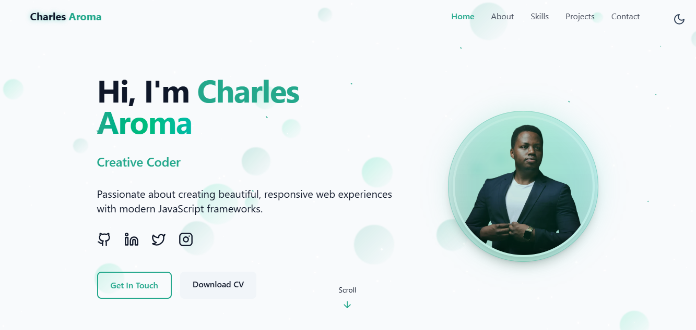

# Charles Aroma - Frontend Developer Portfolio

<div align="center">
  <br />
  <a href="https://charles-aroma.netlify.app" target="_blank">
    
  </a>
  <p><em>🌙 Dark Mode</em></p>
  <br />

  <a href="https://charles-aroma.netlify.app" target="_blank">
    
  </a>
  <p><em>🌙 Dark Mode • ☀️ Light Mode</em></p>
  <br />
  
  <div>
    
    
    
    
    
  </div>
  
  <div align="center">
    <strong>🚀 Live Portfolio:</strong> 
    <a href="https://charles-aroma.netlify.app" target="_blank"><b>charles-aroma.netlify.app</b></a>
  </div>
  <br />
</div>

---

## 👨‍💻 About Me

I'm **Charles Aroma**, a passionate Frontend Developer specializing in creating beautiful, responsive, and user-friendly web experiences. With expertise in modern JavaScript frameworks and a keen eye for design, I craft intuitive interfaces that users love.

### 🎯 What I Bring to Your Team

- **Modern Tech Stack**: React, TypeScript, TailwindCSS, Framer Motion
- **Performance Focus**: Optimized builds with Vite, responsive design
- **User Experience**: Intuitive interfaces with smooth animations
- **Collaboration**: Experience working with teams on production projects
- **Problem Solving**: Creative solutions for complex UI challenges

---

## ⚡ Featured Projects

### 🎨 Portfolio Website

**Modern, responsive portfolio** built with React and TailwindCSS featuring dark mode, smooth animations, and Framer Motion transitions.

**Tech Stack:** React, TailwindCSS, Vite, Framer Motion  
**Live Demo:** [atuhaire-emmanuel.netlify.app](https://atuhaire-emmanuel.netlify.app)  
**GitHub:** [View Code](https://github.com/charlesaroma/atuhaire-emmanuel-portfolio)

### 🎬 Nyati Motion Pictures

**Collaborated on frontend development** for Uganda's leading film production company, creating a responsive platform that showcases authentic African stories.

**Tech Stack:** React, JavaScript, TailwindCSS  
**Live Demo:** [nyatimotionpictures.com](https://nyatimotionpictures.com)

### 📋 Task Management App

**Interactive task management application** with real-time updates, drag-and-drop functionality, and responsive design.

**Tech Stack:** React, JavaScript, TailwindCSS, Framer Motion

---

## 🛠️ Technical Skills

### **Frontend Development**

- **React** - Component-based architecture, hooks, context
- **TypeScript** - Type safety and enhanced development experience
- **TailwindCSS** - Utility-first styling and responsive design
- **Framer Motion** - Smooth animations and micro-interactions

### **Build Tools & Performance**

- **Vite** - Lightning-fast development and optimized builds
- **Git** - Version control and collaborative development
- **Responsive Design** - Mobile-first approach across all devices

### **UI/UX & Design**

- **Modern Design Systems** - Consistent, scalable component libraries
- **Accessibility** - WCAG compliant, keyboard navigation
- **Performance Optimization** - Lazy loading, code splitting, optimization

---

## 🌟 Portfolio Features

### **Interactive Experience**

- 🌑 **Dark/Light Mode Toggle** - Persistent theme preference with smooth transitions
- ✨ **Animated Backgrounds** - Dynamic star field, meteors, and cosmic effects
- 🎭 **Role Showcase** - Animated text transitions showcasing different skills
- 📱 **Responsive Navigation** - Glassmorphism design with mobile optimization

### **Professional Sections**

- 🎯 **Hero Section** - Animated role transitions and smooth scroll navigation
- 👨‍💻 **About Section** - Professional background and service highlights
- 📊 **Skills Grid** - Interactive category filtering with progress animations
- 🖼️ **Projects Showcase** - Full-screen project previews with live demos
- 📩 **Contact Form** - Functional contact form with toast notifications

### **Performance & Quality**

- ⚡ **Lightning Fast** - Optimized with Vite for instant loading
- 📱 **Mobile First** - Responsive design across all devices
- ♿ **Accessible** - WCAG compliant with keyboard navigation
- 🔍 **SEO Optimized** - Meta tags, semantic HTML, performance metrics

---

## 🚀 Quick Start

### Prerequisites

- Node.js (v16 or higher)
- npm or yarn

### Installation

**Using npm:**

```bash
# Clone the repository
git clone https://github.com/charlesaroma/charles-aroma-portfolio.git

# Navigate to project directory
cd charles-aroma-portfolio

# Install dependencies
npm install

# Start development server
npm run dev
```

**Using yarn:**

```bash
# Clone the repository
git clone https://github.com/charlesaroma/charles-aroma-portfolio.git

# Navigate to project directory
cd charles-aroma-portfolio

# Install dependencies
yarn install

# Start development server
yarn dev
```

Visit [http://localhost:5173](http://localhost:5173) to view the portfolio.

### Build for Production

**Using npm:**

```bash
npm run build
npm run preview
```

**Using yarn:**

```bash
yarn build
yarn preview
```

---

## 📞 Let's Connect

I'm always excited to discuss new opportunities and collaborate on interesting projects. Let's build something amazing together!

- **Portfolio:** [charles-aroma.netlify.app](https://charles-aroma.netlify.app)
- **GitHub:** [@charlesaroma](https://github.com/charlesaroma)
- **LinkedIn:** [Charles Aroma](https://www.linkedin.com/in/charles-aroma-8955b62a2)
- **Email:** charlesaroma9@gmail.com

---

<div align="center">
  <sub>Built with ❤️ using React, TailwindCSS, and Framer Motion</sub>
</div>
